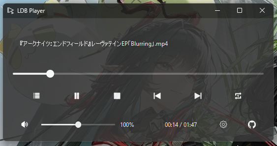

# LDB Player (Live Desktop Background Player)

LDB Player is a Windows-specific media player that transforms your desktop into a live video player. It supports playlists, global hotkeys, drag-and-drop, multi-monitor displays, and seamless desktop integration.

## Features
- Play videos as live desktop backgrounds.
- **Multi-display support** — choose which monitor to use in Settings.
- Playlist management: Add, remove, shuffle, save, and load playlists (with drag-and-drop support).
- Global hotkeys for playback control, volume adjustment, seeking, and navigation.
- Repeat modes (single video or entire playlist).
- Auto start feature on system restart adjustable in Settings.
- Dark-themed, modern user interface.
- Built-in update checker with updater download support.

## Requirements
- Windows 11.
- VLC media player (optional but recommended, download from https://www.videolan.org/vlc/).
- Python 3.10+ (required only for running from source).

## Downloads (For End Users)
- For a ready-to-use version without needing Python or dependencies, download the latest standalone executable (.exe) from the [Releases page](https://github.com/kakao90g/ldb_player/releases). Simply run the .exe to start the player—no installation required.

## Installation from Source (For Developers)
1. Clone or download this repository.
2. Install dependencies: pip install pyqt6 pywin32 python-vlc requests
3. Run the app: python ldb_player.py

## Building a Standalone Executable (For Developers)
To create a single .exe file for distribution (no Python required for users):
1. Install PyInstaller and Pillow if not already installed: pip install pyinstaller pillow.
2. From the project root, run: pyinstaller --onefile --windowed --icon=icons/tray_icon.png --name "LDB Player" --add-data "icons;icons" ldb_player.py
- This bundles the app into dist/LDB Player.exe.
- If VLC integration fails, locate your VLC installation (e.g., C:\Program Files\VideoLAN\VLC) and add flags: --add-binary "C:/Program Files/VideoLAN/VLC/libvlc.dll;." --add-data "C:/Program Files/VideoLAN/VLC/plugins;plugins"
- For PyQt6 issues, add: --add-data "path/to/site-packages/PyQt6/Qt6/plugins;PyQt6/Qt6/plugins"
(Replace with your actual Python site-packages path.)
3. Test the .exe on a clean Windows machine.

## Building the Updater Executable (For Developers)
The updater is a separate script (updater.py) that handles downloading and replacing the main executable during updates. To build it as a standalone .exe:
1. Ensure PyInstaller is installed (as above).
2. From the project root, run: pyinstaller --onefile --windowed --name "updater" updater.py
- This bundles the updater into dist/updater.exe.
- Place updater.exe in the same directory as LDB Player.exe for the update checker to use it automatically.

## Usage
- Add videos via drag-and-drop or the playlist dialog.
- Control playback with hotkeys: Space (play/pause), Arrow keys (seek/volume), etc. (View the full list in Settings > Hotkeys).
- Configuration is saved in %APPDATA%\LDBPlayer.
- Check for updates via Settings > Check for Updates. If an update is available, the app can download the updater and patch the new version automatically.

## Credits and Acknowledgments
- Powered by VLC media player (libvlc) from VideoLAN: https://www.videolan.org/vlc/
- Built with PyQt6 from Riverbank Computing: https://www.riverbankcomputing.com/software/pyqt/
- Utilizes Windows APIs via pywin32 for system integration.
- Other dependencies: Python standard libraries (sys, os, json, etc.), vlc.py bindings.

Support the project:
- GitHub Sponsors: https://github.com/sponsors/kakao90g
- PayPal: https://paypal.me/kakao90g

Join the community:
- Discord: https://discord.gg/TAfUNGHYR3

## Version Changes
- v1.0.8
    - Improved performance and stability
    - Optimized code
- v1.0.6
    - Updated system tray menu
    - Fixed critical playback issue
- v1.0.5
    - Added new welcome screen for new users
    - Minor bug fixes
- v1.0.2
    - Multi-display support
    - Improved auto start stability
    - Removed desktop wallpaper manipulation
    - Various improvements and bug fixes
- v1.0.0
    - Minimal bug fixes
    - Updater function
- v0.9.8
    - Initial release

## License
This project is licensed under the MIT License - see the [LICENSE](LICENSE) file for details.

Developed by @kakao90g.