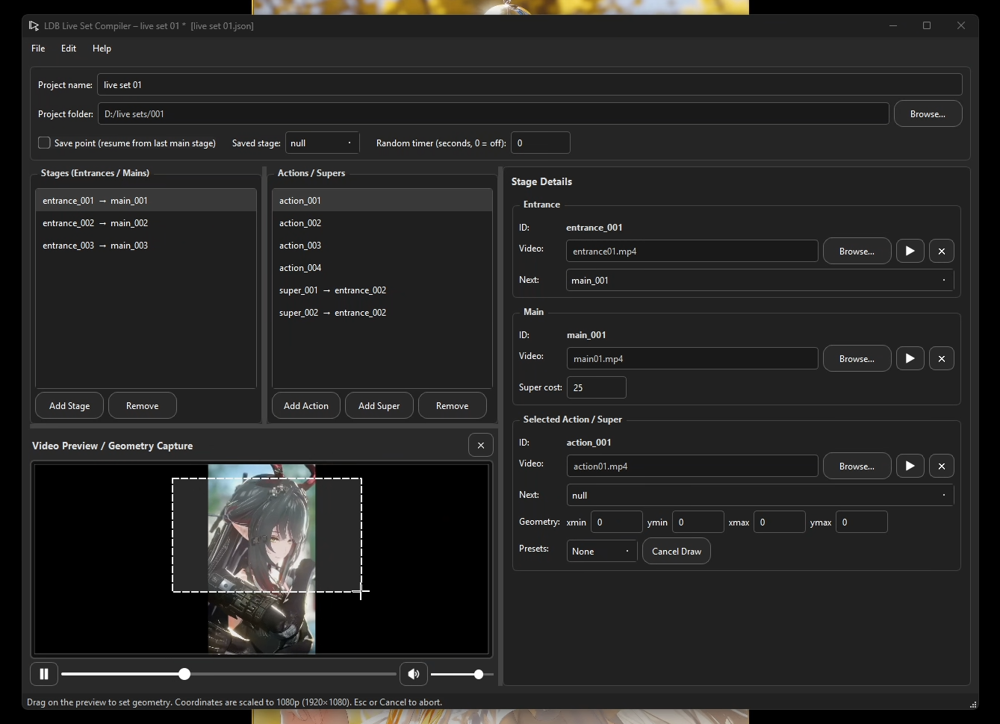

# LDB Player (Live Desktop Background Player)

LDB Player is a lightweight and powerful live wallpaper player for Windows. Experience the feature-rich live set system (interactive live wallpapers) which opens endless possibilities for desktop customization.




## Important: Version & License Split (as of v1.2.0)

| Version          | License              | Distribution                          | Status          |
|------------------|----------------------|---------------------------------------|-----------------|
| **v1.2.0+**      | Proprietary          | Microsoft Store only                  | Current / Official |
| **v1.1.6 and earlier** | MIT (open source) | GitHub Releases (legacy)             | Archived        |

- The Microsoft Store version (v1.2.0 and later) is the **official** release. It includes new features (including the live set system) and is closed-source.
- Older versions (v1.1.6 and below) remain available under the original MIT license for historical / archival purposes only. No further open-source development is planned on that line.

## Latest official version available in Microsoft Store
- Download link: https://apps.microsoft.com/store/detail/9PP860QK40K2?cid=DevShareMCLPCS
- Currently supported regions as of 07/07/2026.
    - English (United States)
- Please check the **FAQ** section below.

## Features
- Play your favorite videos as live wallpapers.
- Play and create engaging live sets with the built-in companion tool.
- Multi-display & multi-instance support — of up to 32 simultaneous instances.
- Smart auto-play feature on system startup adjustable in Settings.
- Playlist management: Add, remove, shuffle, save, and load playlists.
- Global hotkeys for playback control, volume adjustment, seeking, and navigation.
- Repeat modes (single video, entire playlist and auto-mode for live sets).
- Dark-themed, modern user interface.

## Requirements
- Windows 11.
- VLC media player (optional but recommended, download from https://www.videolan.org/vlc/).

## GitHub Releases (legacy)
- Download earlier versions from the [Releases](https://github.com/kakao90g/ldb_player/releases) page.

## Quick Start Guide
- Add videos via drag-and-drop or by using the playlist menu.
- Control playback with hotkeys: Space (play/pause), Arrow keys (seek/volume), etc. (View the full list in Settings > Hotkeys).
- Configuration is saved in %APPDATA%\LDBPlayer.

## Live Sets — Creating Interactive Wallpapers

Live Sets let you build interactive wallpapers. Users can click regions on the screen to trigger **actions** and **supers**, fill a super meter, and move between stages.

### Setup

1. Put all videos **and** the `.json` file in the **same folder**.
2. Use **16:9** videos with the **same resolution, codec, and file type** (recommended: H.264 `.mp4`).
3. Copy the template below → paste into Notepad / VS Code → save as `yourprojectname.json` (All Files / UTF-8).

Geometries are written for **1080p (1920×1080)** and automatically scale to the user’s screen.

### Template

```json
{
  "name": "live set 01",
  "save_point": false,
  "saved_stage": null,
  "random": 0,
  "stages": {
    "entrance_001": { "video": "entrance01.mp4", "next": "main_001" },
    "main_001": {
      "video": "main01.mp4",
      "super_cost": 25,
      "actions": [
        { "id": "action_001", "geometry": [0, 0, 960, 540], "video": "action01.mp4", "next": null },
        { "id": "action_002", "geometry": [960, 0, 1920, 540], "video": "action02.mp4", "next": null },
        { "id": "action_003", "geometry": [0, 540, 960, 1080], "video": "action03.mp4", "next": null },
        { "id": "action_004", "geometry": [960, 540, 1920, 1080], "video": "action04.mp4", "next": null }
      ],
      "supers": [
        { "id": "super_001", "geometry": [0, 0, 960, 540], "video": "super01.mp4", "next": "entrance_002" },
        { "id": "super_002", "geometry": [960, 0, 1920, 540], "video": "super02.mp4", "next": "entrance_002" }
      ]
    },
    "entrance_002": { "video": "entrance02.mp4", "next": "main_002" },
    "main_002": {
      "video": "main02.mp4",
      "super_cost": 30,
      "actions": [
        { "id": "action_001", "geometry": [0, 0, 960, 540], "video": "action05.mp4", "next": null },
        { "id": "action_002", "geometry": [960, 0, 1920, 540], "video": "action06.mp4", "next": null }
      ],
      "supers": [
        { "id": "super_001", "geometry": [0, 540, 960, 1080], "video": "super01.mp4", "next": "entrance_003" },
        { "id": "super_002", "geometry": [960, 540, 1920, 1080], "video": "super02.mp4", "next": "entrance_003" }
      ]
    },
    "entrance_003": { "video": "entrance03.mp4", "next": "main_003" },
    "main_003": {
      "video": "main03.mp4",
      "super_cost": 40,
      "actions": [
        { "id": "action_001", "geometry": [0, 0, 960, 540], "video": "action07.mp4", "next": null },
        { "id": "action_002", "geometry": [960, 0, 1920, 540], "video": "action08.mp4", "next": null }
      ],
      "supers": [
        { "id": "super_001", "geometry": [0, 540, 960, 1080], "video": "super01.mp4", "next": "entrance_001" },
        { "id": "super_002", "geometry": [960, 540, 1920, 1080], "video": "super02.mp4", "next": "entrance_001" }
      ]
    }
  }
}
```

### Field Reference

| Field | Meaning |
|-------|---------|
| `name` | Your project name |
| `save_point` | `true` = remember last main stage and resume from it |
| `saved_stage` | Controlled by the player (`null` or `"main_00x"`). Leave as `null` when distributing |
| `random` | `0` = off. Any number = seconds between auto-triggers of an action/super |
| `super_cost` | `0` = off. Any number = how much each action fills the super meter (max 100). When meter reaches 100, action regions are replaced by super regions |
| `video` | Filename (must be in the same folder) |
| `next` | Where to go after the clip finishes: `null` (stay on current main) or `"entrance_00x"` / `"main_00x"` |

**Fixed names the player looks for**  
`entrance_00x` · `main_00x` · `action_00x` · `super_00x`  

- Do **not** create duplicate stage keys.  
- Actions and supers always belong to a `main_`.

### Stage Key Properties

| Stage key | Description | Accepts clicks | Loop | `next` behavior |
|-----------|-------------|----------------|------|-----------------|
| `entrance_00x` | Optional video played before a main | No | — | `null` = search for the next valid `entrance_00x` / `main_00x` by number order. Can also jump to any `entrance_00x` or `main_00x`. |
| `main_00x` | Video that loops itself and accepts clicks for actions and supers | Yes | Yes | — |
| `action_00x` | Tied to a main. When the super meter reaches 100, action regions are replaced by super regions | Yes | — | `null` = return to its owning main. Can also jump to any `entrance_00x` or `main_00x`. |
| `super_00x` | Tied to a main | No | — | `null` = return to its owning main. Can also jump to any `entrance_00x` or `main_00x`. |

### Geometry Guide

Format: `[xmin, ymin, xmax, ymax]`  
Full screen = `[0, 0, 1920, 1080]`

**Standard quadrants**

```
Upper Left   [0,    0,   960,  540]
Upper Right  [960,  0,  1920,  540]
Lower Left   [0,   540,  960, 1080]
Lower Right  [960, 540, 1920, 1080]
```

Centered box: `[480, 270, 1440, 810]`

**Quick visual**

```
0 ─────────────────────────────── 1920
│ (0,0)                     (1920,0) │
│                                    │
│     (480,270)────────(1440,270)    │
│         │                 │        │
│         │   Centered      │        │
│         │                 │        │
│     (480,810)────────(1440,810)    │
│                                    │
│ (0,1080)                 (1920,1080)│
1080 ───────────────────────────────
```

You can use any rectangle inside these bounds.

### Reminders

- Videos must match in resolution, codec, and container.
- Stage keys must be unique and follow the exact naming pattern.
- Geometry values must be within `0–1920` / `0–1080`.
- Always validate your JSON (trailing commas will break it).
- Add the JSON to the main player to play it.

## FAQ

**How do I add files to play?**
- Open the playlist by pressing **Q** on the keyboard, or click the playlist icon on the main player, then select **Add files**.
- Drag and drop a video file directly onto the player — it will be automatically added to the playlist.

**What file types are currently supported?**
- `.mp4`, `.mkv`, `.avi`, `.mov`, `.wmv`, `.flv`, `.webm`, `.mpeg`, `.mpg`, `.m4v`, `.json`

**Why can't I see my desktop icons?**
- The video window is placed above your desktop icons (and below other open applications). To close the video window using hotkeys, click on it and press **S** on the keyboard.

**When playing vertical "Shorts" videos, I see my desktop wallpaper on the left and right sides. Is this normal?**
- Yes. The current version does not change your wallpaper settings. For a cleaner look, you can temporarily set your desktop background to a solid color.

**The Windows taskbar blocks the bottom of the video. How do I fix this?**
- Right-click the taskbar → **Taskbar settings** → Enable **Automatically hide the taskbar**.

**How do I create or run a new instance?**
- Go to **Settings** → **Create a new LDB Player instance...** → **Confirm the creation**.

**What does a new instance do?**
- It allows you to run LDB Player on multiple displays.
- Each new instance has its own save configuration file for independent customization.

**How do I check which instances are currently open or running?**
- Go to **Settings** → **Instance Manager**.  
  A list of all created instances will be shown. Deleting an instance here will also clean up its save configuration files.

**How do I support the project or developer?**
- Share LDB Player with your friends.
- ⭐ Star the repository on GitHub: https://github.com/kakao90g/ldb_player
- Send a tip through the in-app sponsor links or via the links below.

**Currently Known Issues**
- Please report any issues you experience with the current version on GitHub Issues or in the Discord server.

**Support the project:**
- GitHub Sponsors: https://github.com/sponsors/kakao90g
- PayPal: https://paypal.me/kakao90g

**Join the community:**
- Discord: https://discord.gg/TAfUNGHYR3

## Version Changes
- v1.2.3
    - Added live set compiler
    - Minimal UI adjustments
- v1.2.0
    - Interactive live set system
    - Minimal UI adjustments
- v1.1.6
    - Added a small tweak for multi-instances
    - Latest stable release
- v1.1.5
    - Updated instance handler and instance manager
    - Various improvements and bug fixes
- v1.1.4
    - Added new instance handler and instance manager
    - Added support for multi-instances (up to 32 instances)
    - Updated display change playback behavior
- v1.1.3
    - Optimized code and memory efficiency
    - Stable release
- v1.1.2
    - Fixed critical playback issues
    - Minimal UI adjustments
- v1.1.0
    - A new updated UI
    - Various improvements and bug fixes
- v1.0.9
    - Added safety checks to prevent random crashes
- v1.0.8
    - Optimized code for improved performance and stability
    - Updated playback indexing
    - Fixed autoplay startup issue
- v1.0.6
    - Updated system tray menu
    - Fixed critical playback issue
- v1.0.5
    - Added new welcome screen for new users
    - Minor bug fixes
- v1.0.2
    - Multi-display support
    - Improved auto start stability
    - Removed desktop wallpaper manipulation
    - Various improvements and bug fixes
- v1.0.0
    - Minimal bug fixes
    - Updater function
- v0.9.8
    - Initial release

## Credits and Acknowledgments

**Current version (v1.2.0+ – Microsoft Store)**
- Powered by VLC media player (libVLC) from VideoLAN: https://www.videolan.org/vlc/
- Built with PySide6 (Qt for Python) from The Qt Company: https://www.qt.io/qt-for-python
- Utilizes Windows APIs via pywin32 for system integration.
- Other dependencies: Python standard libraries, python-vlc, etc.

**Legacy versions (v1.1.6 and earlier)**
- Built with PyQt6 from Riverbank Computing.
- Same VLC / pywin32 / python-vlc stack.

A complete list of third-party licenses and notices is available in the application and in the repository [NOTICE](NOTICE) file (for the open-source line).

## License

### Current version (v1.2.0 and later)
Copyright (c) 2025–2026 @kakao90g. All rights reserved.

This version is proprietary software. It is distributed exclusively through the Microsoft Store and is governed by the Microsoft Standard Application License Terms together with any additional terms provided by the publisher.

The source code for v1.2.0+ is not publicly available.

### Legacy versions (v1.1.6 and earlier)
These versions remain licensed under the MIT License.  
See the [LICENSE](LICENSE) file for the full text.

The last open-source release is v1.1.6. Future development continues only on the proprietary Microsoft Store line.

Developed by @kakao90g.