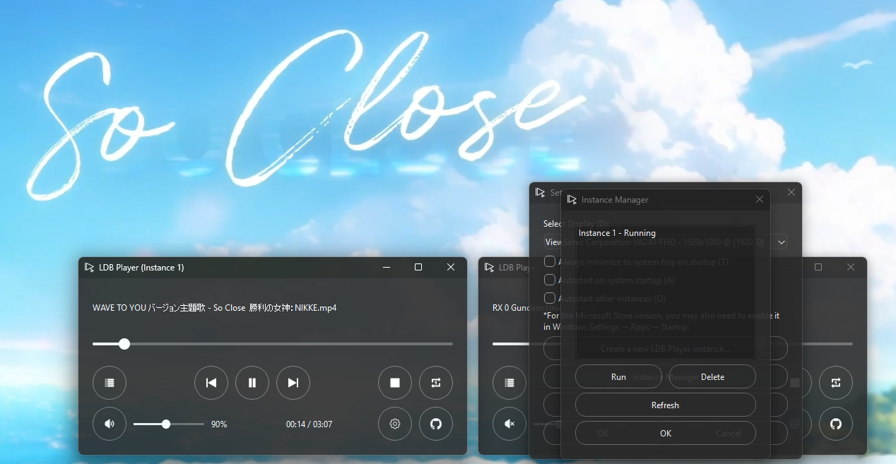

# LDB Player (Live Desktop Background Player)

LDB Player is a Windows-specific media player that transforms your desktop into a live video player. It supports playlists, global hotkeys, drag-and-drop, multi-monitor displays, and seamless desktop integration.

## Now available in Microsoft Store
- Download link: https://apps.microsoft.com/store/detail/9PP860QK40K2?cid=DevShareMCLPCS
- Currently supported regions as of 07/07/2026.
    - English (United States)
- Please check the **FAQ** section below.

## Features
- Play videos as live desktop backgrounds.
- Multi-display support — choose which monitor to use in Settings.
- Playlist management: Add, remove, shuffle, save, and load playlists.
- Global hotkeys for playback control, volume adjustment, seeking, and navigation.
- Repeat modes (single video or entire playlist).
- Auto play feature on system restart adjustable in Settings.
- Dark-themed, modern user interface.

## Requirements
- Windows 11.
- VLC media player (optional but recommended, download from https://www.videolan.org/vlc/).

## GitHub Releases  
- Download the latest version from the [Releases](https://github.com/kakao90g/ldb_player/releases) page.

## Usage
- Add videos via drag-and-drop or by using the playlist menu.
- Control playback with hotkeys: Space (play/pause), Arrow keys (seek/volume), etc. (View the full list in Settings > Hotkeys).
- Configuration is saved in %APPDATA%\LDBPlayer.

## FAQ

**1. How do I add files to play?**
- Open the playlist by pressing **Q** on the keyboard, or click the playlist icon on the main player, then select **Add files**.
- Drag and drop a video file directly onto the player — it will be automatically added to the playlist.

**2. What file types are currently supported?**
- `.mp4`, `.mkv`, `.avi`, `.mov`, `.wmv`, `.flv`, `.webm`, `.mpeg`, `.mpg`, `.m4v`

**3. Why can't I see my desktop icons?**
- The video window is placed above your desktop icons (and below other open applications). This is normal behavior.

**4. When playing vertical "Shorts" videos, I see my desktop wallpaper on the left and right sides. Is this normal?**
- Yes. The current version does not change your wallpaper settings. For a cleaner look, you can temporarily set your desktop background to a solid color.

**5. The Windows taskbar blocks the bottom of the video. How do I fix this?**
- Right-click the taskbar → **Taskbar settings** → Enable **Automatically hide the taskbar**.

**6. How do I create or run a new instance?**
- Go to **Settings** → **Create a new LDB Player instance...** → **Confirm the creation**.

**7. What does a new instance do?**
- It allows you to run LDB Player on multiple displays.
- Each new instance has its own save configuration file for independent customization.

**8. How do I check which instances are currently open or running?**
- Go to **Settings** → **Instance Manager**.  
  A list of all created instances will be shown. Deleting an instance here will also clean up its save configuration files.

**9. How do I support the project or developer?**
- Share LDB Player with your friends.
- ⭐ Star the repository on GitHub: https://github.com/kakao90g/ldb_player
- Send a tip through the in-app sponsor links or via the links below.

**Currently Known Issues**
- Please report any issues you experience with the current version on GitHub Issues or in the Discord server.

**Support the project:**
- GitHub Sponsors: https://github.com/sponsors/kakao90g
- PayPal: https://paypal.me/kakao90g

**Join the community:**
- Discord: https://discord.gg/TAfUNGHYR3

## Version Changes
- v1.1.6
    - Added a small tweak for multi-instances
    - Latest stable release
- v1.1.5
    - Updated instance handler and instance manager
    - Various improvements and bug fixes
- v1.1.4
    - Added new instance handler and instance manager
    - Added support for multi-instances (up to 32 instances)
    - Updated display change playback behavior
- v1.1.3
    - Optimized code and memory efficiency
    - Stable release
- v1.1.2
    - Fixed critical playback issues
    - Minimal UI adjustments
- v1.1.0
    - A new updated UI
    - Various improvements and bug fixes
- v1.0.9
    - Added safety checks to prevent random crashes
- v1.0.8
    - Optimized code for improved performance and stability
    - Updated playback indexing
    - Fixed autoplay startup issue
- v1.0.6
    - Updated system tray menu
    - Fixed critical playback issue
- v1.0.5
    - Added new welcome screen for new users
    - Minor bug fixes
- v1.0.2
    - Multi-display support
    - Improved auto start stability
    - Removed desktop wallpaper manipulation
    - Various improvements and bug fixes
- v1.0.0
    - Minimal bug fixes
    - Updater function
- v0.9.8
    - Initial release

## Credits and Acknowledgments
- Powered by VLC media player (libvlc) from VideoLAN: https://www.videolan.org/vlc/
- Built with PyQt6 from Riverbank Computing: https://www.riverbankcomputing.com/software/pyqt/
- Utilizes Windows APIs via pywin32 for system integration.
- Other dependencies: Python standard libraries (sys, os, json, etc.), vlc.py bindings.

A complete list of third-party licenses and notices is available in the application and in the repository [NOTICE](NOTICE) file.

## License
This project is licensed under the MIT License - see the [LICENSE](LICENSE) file for details.

Developed by @kakao90g.